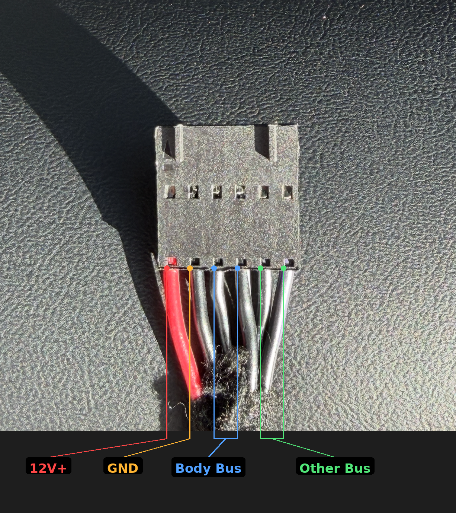
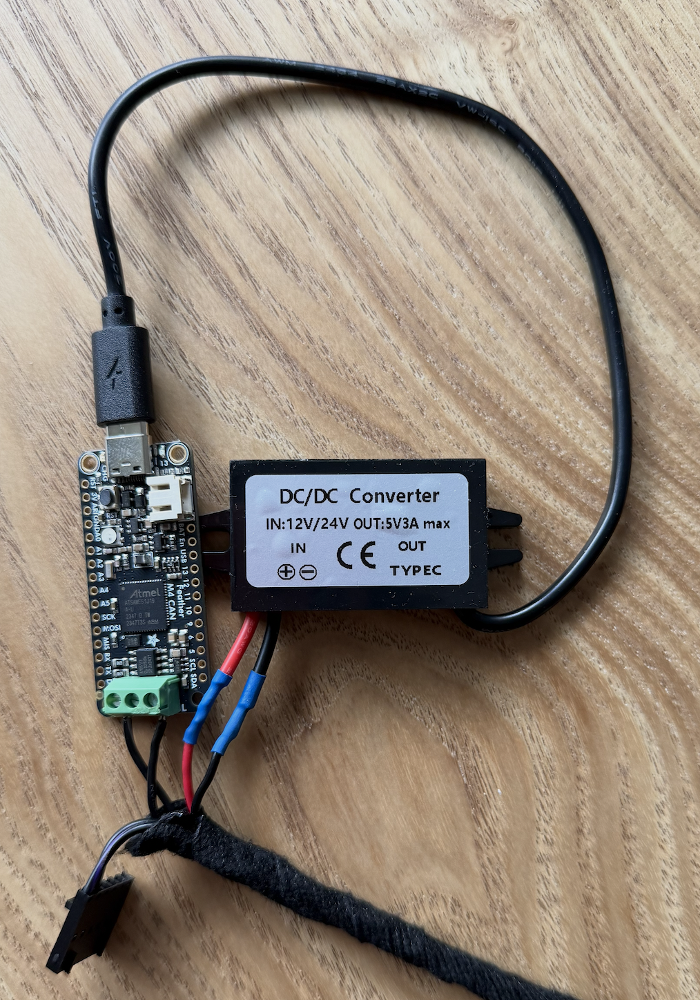
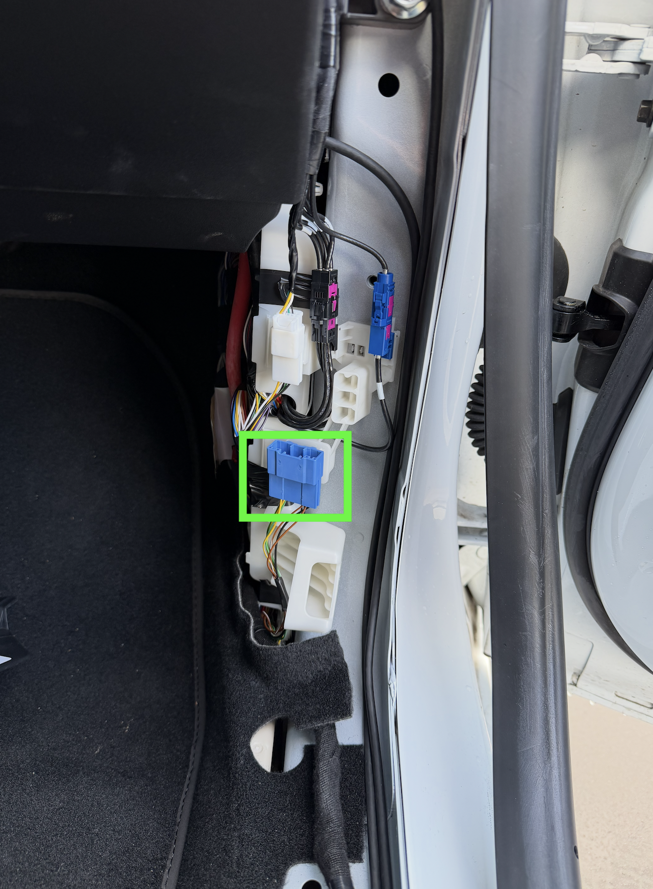

# Installation Guide: Adafruit Feather M4 CAN Express on Tesla Model 3 HW3

This guide covers a complete installation of the Tesla Open CAN Mod on a **2023 Tesla Model 3 with HW3**, using the **Adafruit Feather M4 CAN Express (ATSAME51)**.

## Parts List

| Part | Approx. Cost | Link |
|---|---|---|
| Adafruit Feather M4 CAN Express (ATSAME51) | ~20 EUR | [antratek.nl](https://www.antratek.nl/feather-m4-can-express-with-atsame51) |
| Enhance Auto Tesla Gen 2 Cable | ~30 EUR | [enhauto.com](https://www.enhauto.com/products/tesla-gen-2-cable?variant=41214470094923) |
| 12V/24V to 5V USB-C DC/DC Converter | ~5 EUR | [aliexpress.com](https://nl.aliexpress.com/item/1005008928142771.html) |

## Important Notes

- The Feather M4 CAN Express uses the ATSAME51's **built-in CAN (MCAN) controller** with an onboard TJA1051T/3 transceiver. It does **not** use the MCP2515 SPI library — it requires the **Adafruit CAN** library (`CANSAME5x`).
- The Enhance Auto Gen 2 Cable connects to the same port as their S3XY Commander, providing both CAN bus data and 12V power through a single connector.

## Step 1: Flash the firmware

1. Install the [Arduino IDE](https://www.arduino.cc/en/software).
2. Add the Adafruit board package URL in **File → Preferences → Additional Board Manager URLs**:
   ```
   https://adafruit.github.io/arduino-board-index/package_adafruit_index.json
   ```
3. Install **Adafruit SAMD Boards** via **Tools → Board → Boards Manager**.
4. Install the **Adafruit CAN** library via **Sketch → Include Library → Manage Libraries**.
5. Open the sketch and set your hardware target at the top:
   ```cpp
   #define HW_TARGET TARGET_HW3  // Change to TARGET_LEGACY, TARGET_HW3, or TARGET_HW4
   ```
6. Select **Adafruit Feather M4 CAN (SAME51)** as the board under **Tools → Board**.
7. Connect the Feather via USB, select the correct port, and click **Upload**.
8. Open the Serial Monitor at **115200 baud** — you should see `CANSAME5x ready @ 500k`.

## Step 2: Identify the Enhance Auto connector pinout

The Enhance Auto Gen 2 Cable has a connector on the end that normally plugs into a S3XY Commander. We'll use this connector to tap into the vehicle's CAN bus and 12V power.



| Wire | Signal | Connect to |
|---|---|---|
| Red | 12V+ | DC/DC converter IN+ |
| Black | GND | DC/DC converter IN- |
| Black with stripe | CAN-H (Body Bus) | Feather CAN-H screw terminal |
| Black solid | CAN-L (Body Bus) | Feather CAN-L screw terminal |
| Remaining black pair | Other Bus | Not used — leave disconnected |

## Step 3: Wire the board

Connect the Enhance Auto cable's CAN-H (black with stripe) and CAN-L (black solid) wires to the Feather's CAN screw terminal. Wire the 12V+ (red) and GND (black) to the DC/DC converter's input. The converter outputs 5V via USB-C, which plugs directly into the Feather to power it.



## Step 4: Connect to the car

The Enhance Auto Gen 2 Cable plugs into the **X179 connector**, located behind the driver's side trunk panel. Remove the panel trim to access the connector cluster.



Plug in the Enhance Auto cable — it provides both CAN bus data and 12V power through a single connection. No jumper wires needed.

For a video guide on how to access the X179 connector and plug in the cable, see [this installation video by Enhance Auto](https://youtube.com/watch?v=ifwJNZgykVI).

## Step 5: Verify

1. Disconnect the DC/DC converter from the Feather's USB-C port and connect your laptop instead.
2. Open the Serial Monitor at **115200 baud** — you should see handler output like:
   ```
   HW3Handler: FSD: 1, Profile: 2, Offset: 0
   ```
3. Enable **"Traffic Light and Stop Sign Control"** in Autopilot settings if not already enabled.
4. Change the follow-distance setting on the stalk and verify the Profile value changes.
5. Once everything is working, disconnect your laptop and plug the DC/DC converter back in — you're done.

## Tested On

- **Vehicle:** 2023 Tesla Model 3
- **Hardware:** HW3
- **Board:** Adafruit Feather M4 CAN Express (ATSAME51)
- **Connection:** Enhance Auto Tesla Gen 2 Cable → X179 connector
- **Power:** 12V/24V to 5V USB-C DC/DC converter